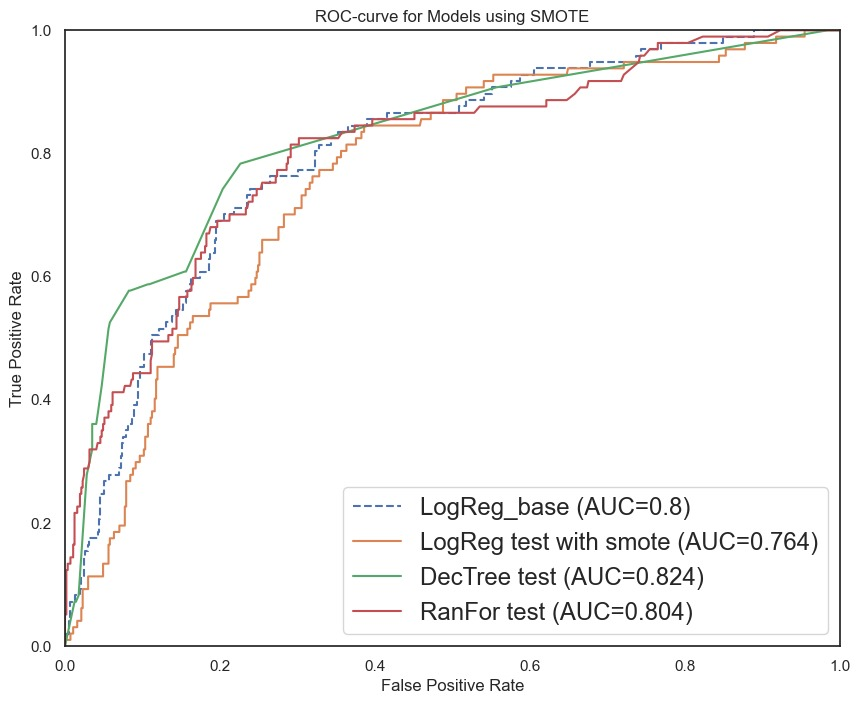

    

# Telecom Customer Churn Prediction

**Author**: Lynn Komen 

## Overview
SyriaTel faces a challenge with customer churn, impacting revenue and market standing. This project aims to predict churn using key features like customer service calls, daytime call minutes, and international plan subscriptions. We conduct exploratory data analysis to identify patterns and correlations. By selecting crucial features and training various classifier models, we aim to maximize the F1 score, while also considering AUC-ROC and accuracy. The best model will provide actionable insights, enabling SyriaTel to implement targeted retention strategies, improve customer satisfaction, and reduce churn, thereby driving business growth and maintaining a competitive edge in the telecom industry.

## Business Understanding
My client, SyriaTel, is a telecommunications company facing a significant challenge: customer churn. They've noticed an increasing number of customers leaving their service, which is not only impacting their revenue but also their reputation in the market. To address this issue effectively, SyriaTel has approached us to develop a predictive model that can identify potential churners and provide insights to help reduce churn rates.

The primary objective of this project is to develop a churn prediction model that accurately identifies customers at risk of leaving SyriaTel's service. By leveraging historical customer data, we aim to build a classifier model that can predict churn patterns based on key features such as the number of customer service calls, total minutes spent on calls during the day, and whether the customer subscribes to the international plan

## Data Understanding
Our data source is the SyriaTel customer churn dataset. The dataset includes 20 features related to customer subscriptions to SyriaTel, such as account length, number of calls at various times, the associated charges to their account for those calls, and the number of calls made to customer service lines in regard to their subscription.

## Methods
This project uses Logistic Regressions, Decision Trees and RandomForest Models.  
 
## Results

Base Logistic Regression Model is the best tool for predicting customer behavior, especially with a fantastic F1 score.  
That is also proven by the best ROC-curve.

    

 
 
The important features that informed this model were if clients had an international plan, how many minutes they talked on the phone during the day, and how many calls they made to customer service.  
 
 ## Conclusions
The best model, is the Decision Tree Model with an accuracy of  82.4% accuracy. The most influential features were whether the client had an internal plan, the total minutes talked during the day, and the number of customer service calls. These features significantly contributed to the model's predictive power and overall performance

## Recommendations
- Focus marketing efforts on clients with internal plans to increase retention and satisfaction through 
 targeted incentives.

- Monitor and optimize daily call minutes, offering tailored plans for heavy users to improve customer 
 experience.

- Enhance customer service quality, reducing the number of calls by addressing common issues effectively 
  and proactively.
## Next Steps 
- Integrating datetime data enables temporal analysis, tracking trends, and identifying 
  seasonality in customer interactions for actionable insights.

- Leveraging NLP models extracts sentiment and topics from customer feedback, correlating 
  sentiments with churn, satisfaction, and preferences.

- Predictive modeling forecasts churn and identifies drivers using datetime and sentiment- 
  based features, guiding retention and service improvement strategies.

- Continuous monitoring, iteration, and automation ensure effectiveness, enabling refinement 
  and optimization of analysis and modeling processes.
 

## Appendix
The complete analysis can be found in the <a href="Telecom-Churn.ipynb">Jupyter Notebook</a> and in our <a href="Presentation.pdf">presentation</a>.

## Sources

<a href="https://www.kaggle.com/becksddf/churn-in-telecoms-dataset">The Dataset </a>

└── presentation.pdf

